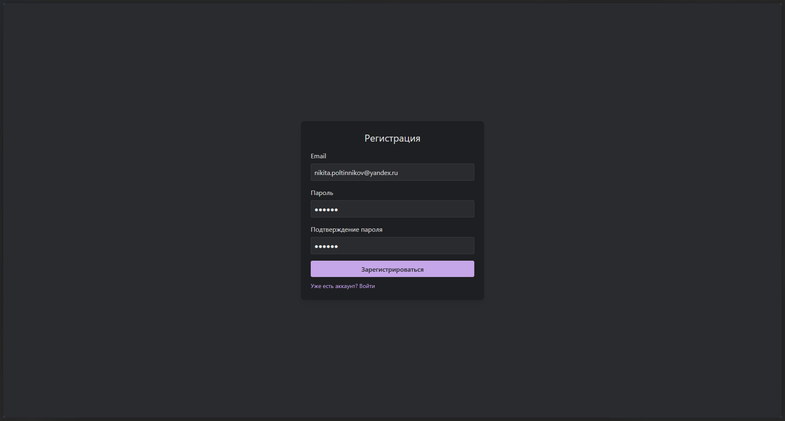
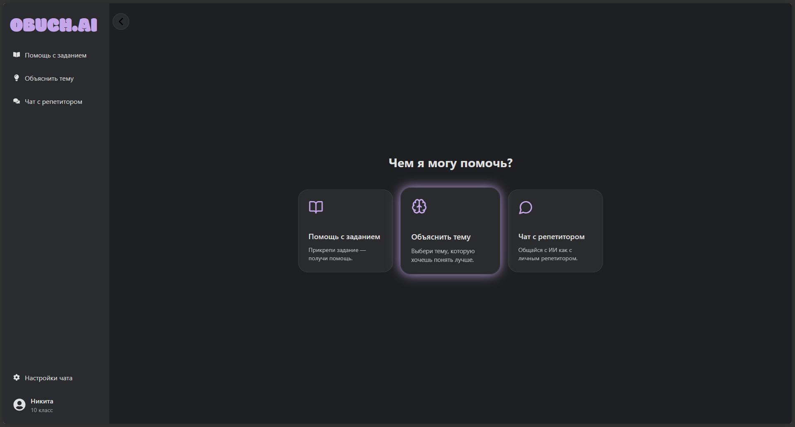
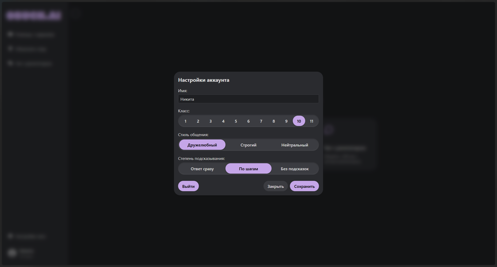
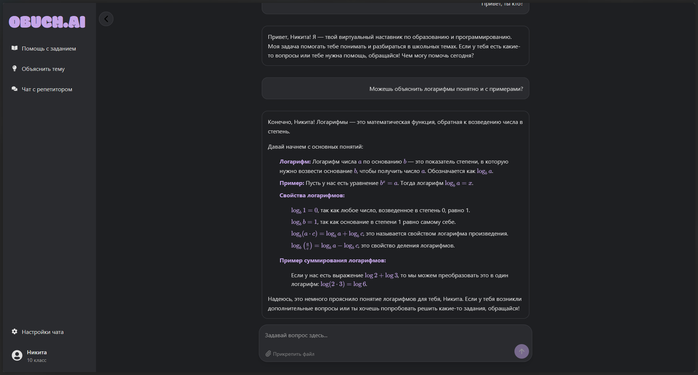
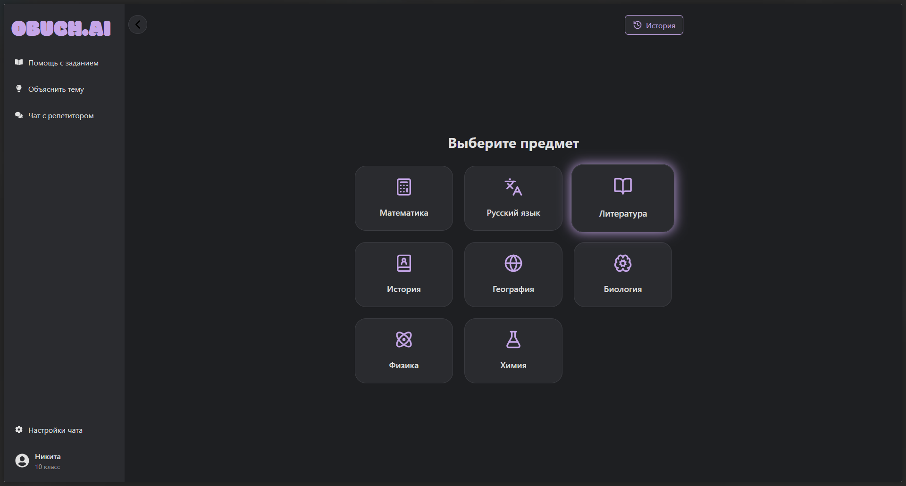
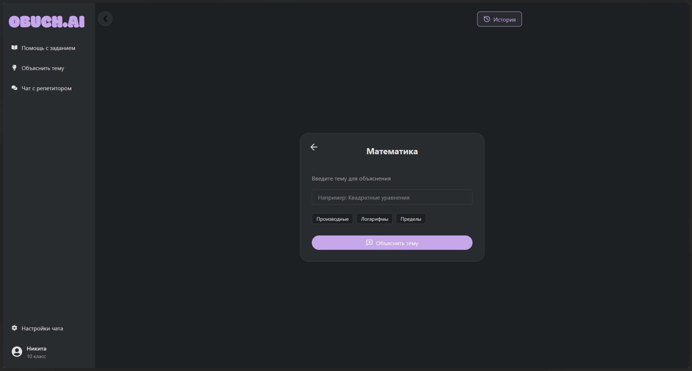
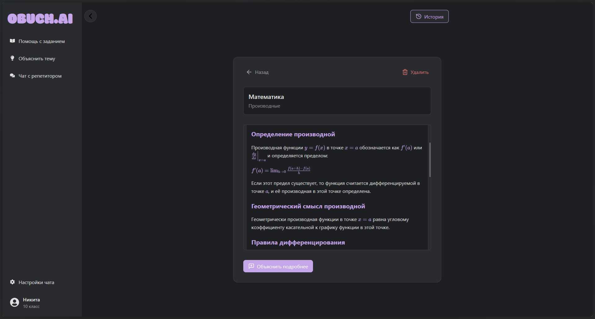
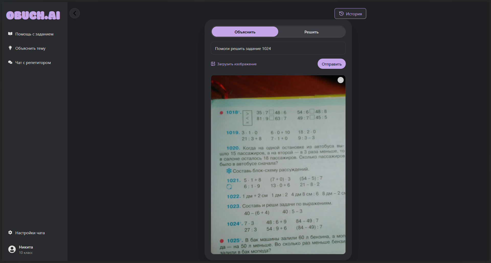
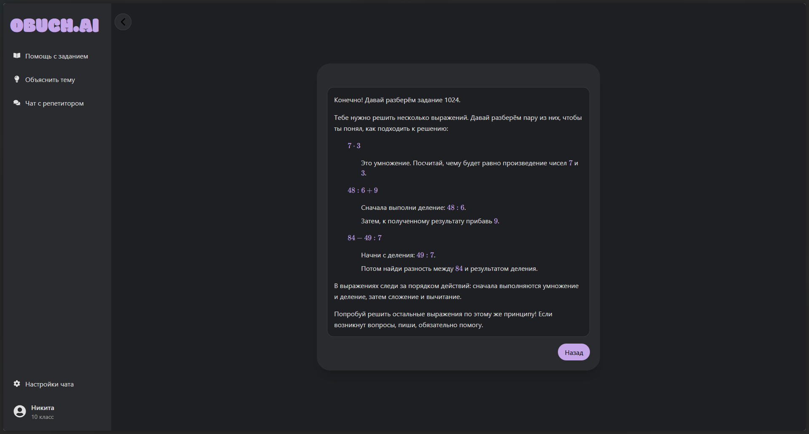

# 🤖 OBUCH.AI

**OBUCH.AI** — учебный проект: веб-приложение, в котором ИИ выступает в роли персонального репетитора для школьников. Проект сделан как полноценное приложение с фронтендом, бекендом и базой данных.

---

## ✨ Возможности

### Профиль пользователя

* имя ученика
* класс
* стиль общения
* степень подсказывания

Эти данные используются ИИ при общении.

---

### Чат с репетитором

* обычный чат с сохранением истории
* ИИ настроен как школьный репетитор
* ответы адаптируются под данные пользователя

---

### Объяснить тему

* предметы рекомендуются на основе класса
* темы можно выбрать или ввести вручную
* есть подсказки при вводе темы
* все объяснения сохраняются
* кнопка «объяснить подробнее»

---

### Помощь с заданием

* ввод задания текстом или фотографией
* режимы: объяснить или решить
* история заданий сохраняется

---

## 🖼️ Скриншоты

---

## 🛠️ Технологии

Frontend: React, Vite, Tailwind CSS

Backend: Node.js

Database & Auth: Supabase

---

## 📌 Статус

Учебный проект, сделан для практики работы с React, backend, базой данных и ИИ.
